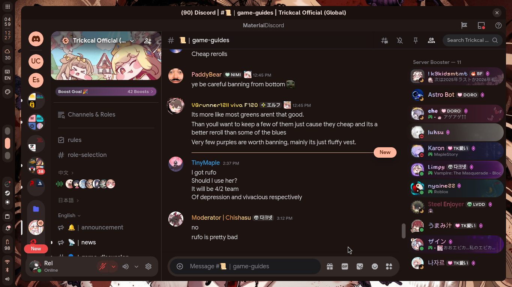

# Discord Port - Roxana Theme

A warm, soft, rosy-cocoa Discord theme with Material Design 3 aesthetics.

## Preview



Light and dark variants with creamy surfaces, peach accents, and smooth Material You transitions.

## Features

- 🎨 **Material Design 3** - Based on Material Discord with Roxana color tokens
- 🌓 **Light & Dark modes** - Automatically follows Discord's theme setting
- 🎯 **Consistent colors** - Mapped directly from Roxana design tokens
- ✨ **Custom refinements** - Enhanced selected states, bot tags, and popouts

## Requirements

[BetterDiscord](https://betterdiscord.app/), [Vesktop](https://vesktop.dev/), [Equibop](https://github.com/Equicord/Equibop) or any Discord client that supports custom themes.

## Installation

### Method 1: Local Install

1. Download [`roxana.css`](roxana.css)
2. Open Discord settings → Equicord Settings → Themes
3. Click "Open Themes Folder"
4. Place `roxana.css` in the themes folder
5. Enable "Roxana" in the themes list

### Method 2: Online Install

1. Open Discord settings → Equicord Settings → Themes
2. Click "Enable Online Themes"
3. Enter the URL:
   `https://raw.githubusercontent.com/elliottophellia/roxana/main/ports/discord/roxana.css`
4. Enable "Roxana" in the themes list

## Usage

The theme automatically adapts to Discord's light/dark mode setting:
- **Settings → Appearance → Theme** → Choose Light or Dark

## Customization

The theme uses CSS variables at the top of the file. You can modify colors by editing the `:root` section in `roxana.css`:

```css
:root {
  --primaryLight: #8F4C35;
  --primaryDark: #FFB59C;
  /* ... other variables ... */
}
```

## Technical Details

- **Base**: [Material Discord](https://github.com/CapnKitten/BetterDiscord/tree/master/Themes/Material-Discord)
- **Color system**: Material Design 3 (Material You)
- **Token mapping**: From `../../tokens/roxana.light.json` and `roxana.dark.json`

### Color Roles

| Token | Light | Dark | Usage |
|---|---|---|---|
| Primary | `#8F4C35` | `#FFB59C` | Accent color, buttons |
| Secondary | `#77574C` | `#E7BDB0` | Selected states |
| Secondary Container | `#FFDBCF` | `#5D4036` | Selected channel backgrounds |
| Surface Container | `#FCEAE5` | `#271D1A` | Message hover, cards |

## Troubleshooting

**Theme not showing up?**
- Make sure BetterDiscord is installed and enabled
- Check that the file is named `roxana.css` (not `roxana.css.txt`)
- Reload Discord (Ctrl+R / Cmd+R)

**Colors look wrong?**
- The theme follows Discord's light/dark mode setting
- Try toggling between light and dark mode
- Clear Discord cache if colors appear broken

**Material Discord base not loading?**
- Requires internet connection for the `@import` to work
- Check Discord console (Ctrl+Shift+I) for network errors

## Contributing

Found an issue or want to improve the theme? Open an issue or PR in the main repository.

## License

MIT License - See [main repository](../../README.md) for details.
