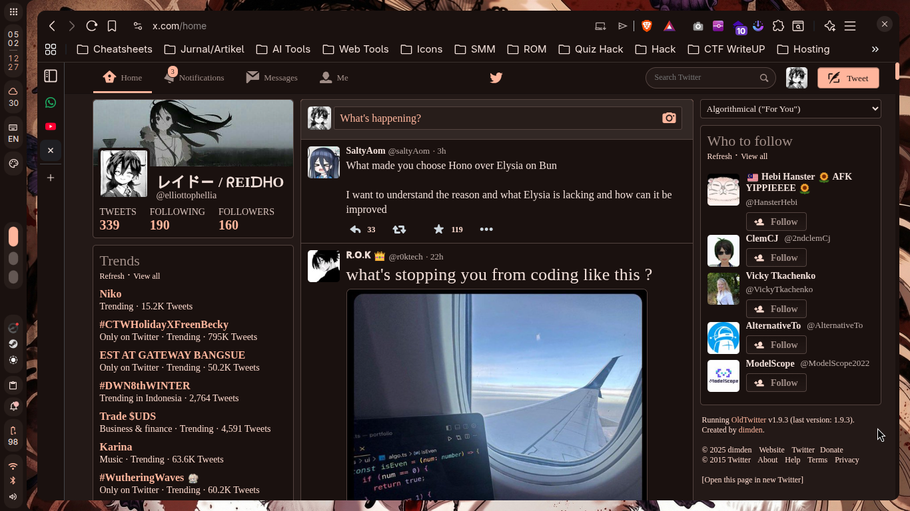

# OldTwitter Port - Roxana Theme

A warm, soft, rosy-cocoa theme for OldTwitter with dark color scheme.

## Preview



Dark mode theme with creamy surfaces, peach accents, and warm chocolate tones.

## Features

- 🌓 **Dark theme** - Optimized for comfortable night viewing
- 🎯 **Consistent colors** - Mapped directly from Roxana design tokens
- 🦋 **Warm aesthetic** - Rosy-cocoa colors instead of harsh blacks
- ✨ **Clean interface** - Subtle borders and smooth backgrounds

## Requirements

- [OldTwitter extension](https://github.com/dimdenGD/OldTwitter) installed
  - Available for Chrome, Firefox, and other browsers

## Installation

### Method 1: Extension Settings

1. Download [`roxana.css`](roxana.css)
2. Install the [OldTwitter extension](https://github.com/dimdenGD/OldTwitter)
3. Open Twitter (X) with OldTwitter enabled
4. Click the OldTwitter settings (gear icon)
5. Go to **Colors** or **Advanced Colors** section
6. Click on **Import** and select `roxana.css` in your file explorer

## Color Variables

The theme uses CSS custom properties based on Roxana dark tokens:

```css
--background-color: #1a110f;          /* Dark background */
--darker-background-color: #231917;   /* Surface container low */
--input-background: #271d1a;          /* Surface container */
--new-tweet-over: #322825;            /* Surface container high */
--active-message: #5d4036;            /* Secondary container */
--default-text-color: #f1dfd9;        /* On surface */
--border: #53433f;                    /* Outline variant */
```

## Customization

Edit any color variable in the CSS to customize the theme:

```css
--background-color: #1a110f;  /* Change to your preferred background */
--border: #53433f;            /* Change border color */
```

## Technical Details

- **Color system**: Material Design 3 (Material You) dark palette
- **Token source**: `../../tokens/roxana.dark.json`
- **Base theme**: Custom OldTwitter CSS variables

### Color Mapping

| OldTwitter Variable | Roxana Token | Value |
|---|---|---|
| `--background-color` | `backgroundDark` | `#1a110f` |
| `--dark-background-color` | `surfaceContainerLowestDark` | `#140c0a` |
| `--darker-background-color` | `surfaceContainerLowDark` | `#231917` |
| `--input-background` | `surfaceContainerDark` | `#271d1a` |
| `--new-tweet-over` | `surfaceContainerHighDark` | `#322825` |
| `--active-message` | `secondaryContainerDark` | `#5d4036` |
| `--default-text-color` | `onSurfaceDark` | `#f1dfd9` |
| `--border` | `outlineVariantDark` | `#53433f` |

## Troubleshooting

**Theme not applying?**
- Make sure OldTwitter extension is installed and enabled
- Check that you've pasted the CSS in the correct field
- Reload Twitter (Ctrl+R / Cmd+R)
- Clear browser cache if needed

**Colors look off?**
- Ensure you're using the latest version of OldTwitter
- Some custom CSS fields may require specific syntax
- Check browser console (F12) for CSS errors

**OldTwitter not working?**
- Twitter (X) frequently changes their layout
- Update to the latest OldTwitter version
- Check the [OldTwitter repository](https://github.com/dimdenGD/OldTwitter) for updates

## Contributing

Found an issue or want to improve the theme? Open an issue or PR in the main repository.

## License

MIT License - See [main repository](../../README.md) for details.
